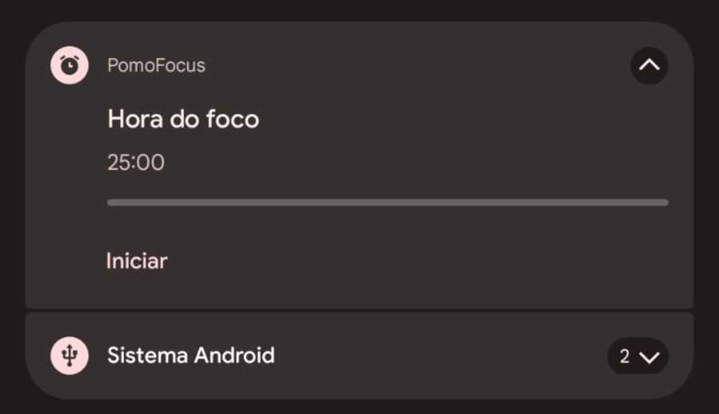
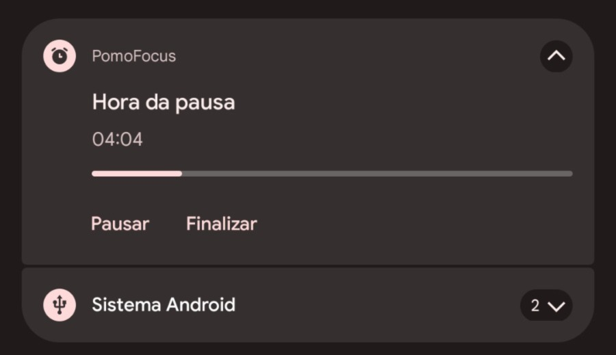
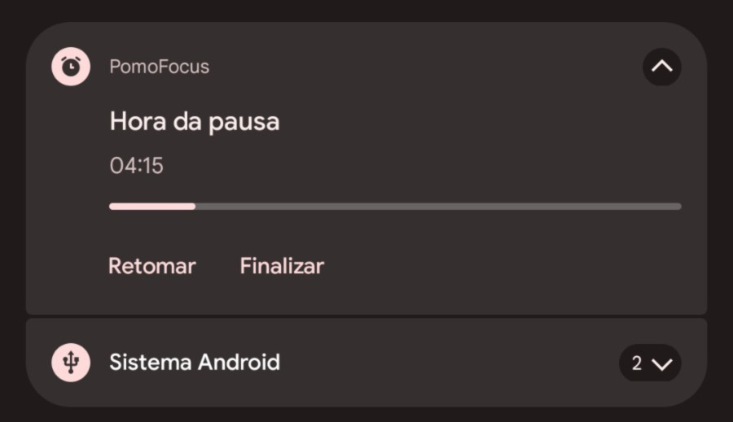
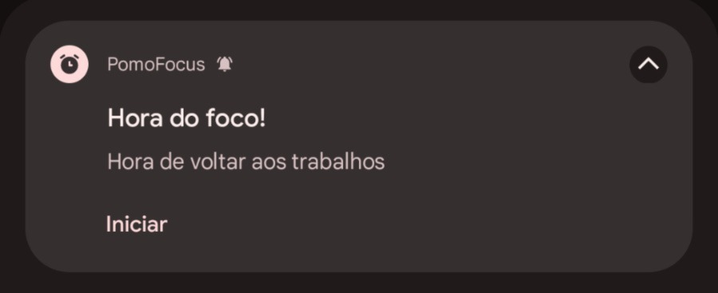

# Pomofocus
Aplicativo Android de foco nas atividades

## Objetivo
Aumentar a produtividade nas atividades do dia a dia com base no gerenciamento de tempo de foco e pausa

## Funcionalidades
- Iniciar timer para foco/pausa
- Pausar timer
- Finalizar timer
- Alternar o timer, mudar entre foco e pausa (e vice-versa)
- Controlar timer por notificação
- Receber notificação quando o timer finalizar

## Linguagem
Kotlin - Jetpack Compose

## Frameworks
- Service
- Notification
- Adaptive Layout

## Screenshots
#### App

#### Notification
   
